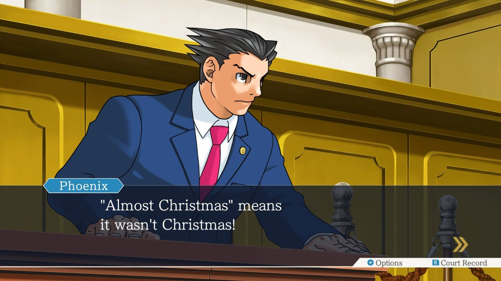
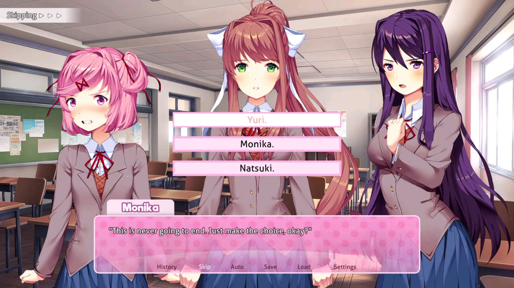
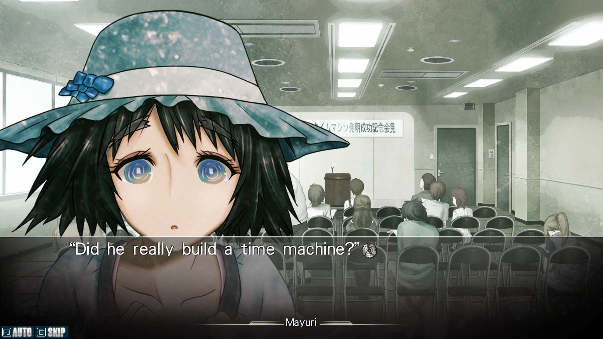
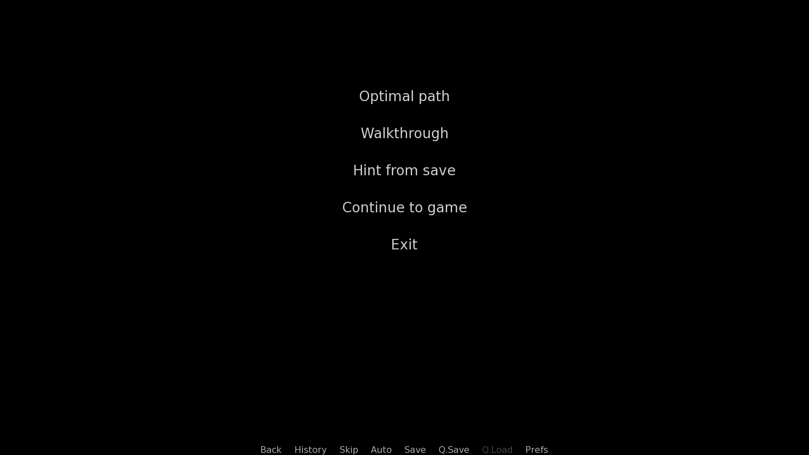
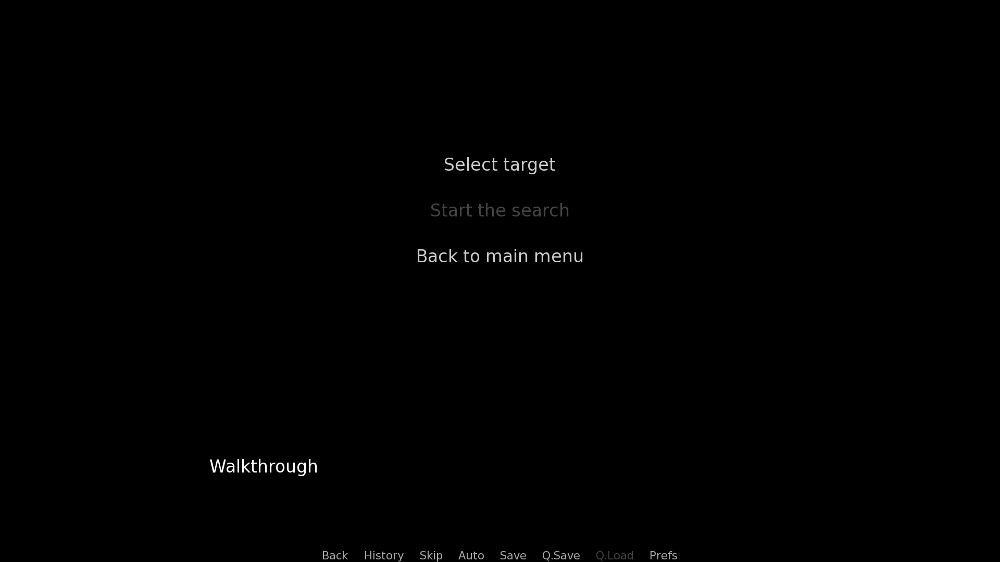
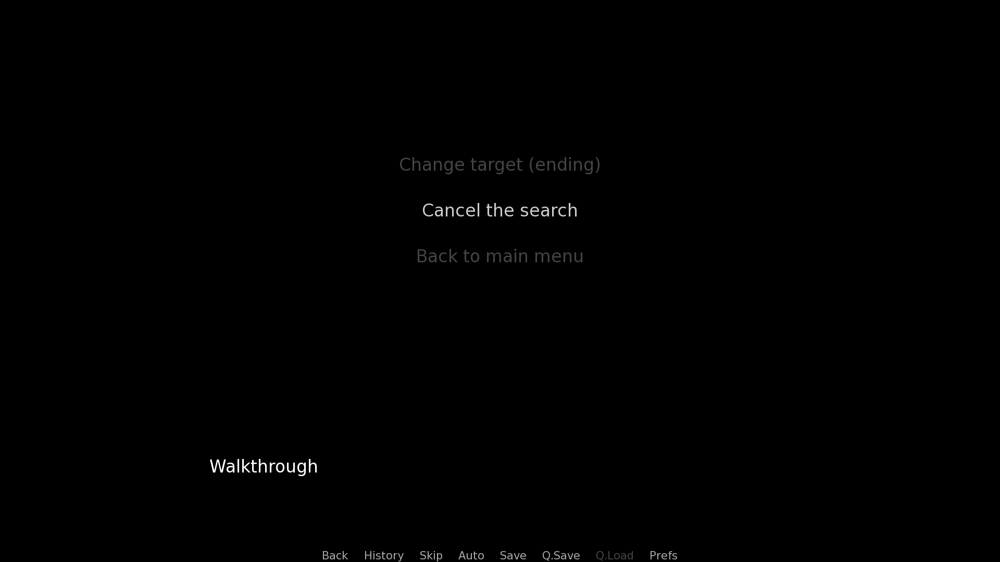

# Functional specifications - Renpath

`Functional version 1 - "Pathfinder"`

- [Context](#context)
  - [What are Visual Novels?](#what-are-visual-novels)
  - [Examples of Visual Novels](#examples-of-visual-novels)
- [Scope](#scope)
- [Deliverables](#deliverables)
- [Timeline](#timeline)
- [Competitors](#competitors)
  - [Renpy Graph Vizualiser](#renpy-graph-vizualiser)
- [Use cases](#use-cases)
  - [Walkthrough creation](#walkthrough-creation)
  - [Player stuck on choice](#player-stuck-on-choice)
- [Risk and assumptions](#risk-and-assumptions)
  - [Risk analysis](#risk-analysis)
  - [Assumptions](#assumptions)
- [Requirements](#requirements)
  - [Functional requirements](#functional-requirements)
  - [Non-functional requirements](#non-functional-requirements)
- [Glossary](#glossary)

## Context

The modern world is ruled by two types of distractions: Social media and video games. In 2023, the sales of video games generated $184 billion ([source](https://newzoo.com/resources/blog/games-market-estimates-and-forecasts-2023)).

While the development of video games is always growing, the expectations of the players are increasing even faster. Many tools exist in this domain to ease the work of developers in many fields. \
One category of games that lacks tools is the one of Visual Novel games. This market is important as the simplicity of these games makes them easily portable to multiple platforms (PC, Mobile, Web, ...).

Creating such a tool will be my End-of-Degree project.

> [!NOTE]
> The name "Renpath" reflects the state of the project for this first version. It will likely change in the future as restrictions on the scope decrease.

### What are Visual Novels?

Visual Novels (VN for short) are a type of video game that could be described as "books for computers." Most of the time, they are accompanied by images, music, and sounds, as well as videos and interactive buttons. What differentiates them the most is that they are interactive. The player is provided with choices that change the story, offering a variety of scenarios.

### Examples of Visual Novels

**Ace Attorney**: In this franchise, you play as a lawyer who must prove your client's innocence through courtroom battles and investigations.

**Doki Doki Literature Club**: Renpy's most famous game starts as a typical romance visual novel but quickly transforms into a psychological thriller.

**Steins;Gate**: This visual novel follows students who discover and develop technology that allows them to change the past, leading to a complex narrative about time travel.

## Scope

The goal of this project is to provide a variety of tools for developers and players of Visual Novels.
The software will come as an extension that can be added to any existing or in-development games, displaying a custom interface when the game is launched.

For the first version of the program, the software will limit itself to games created with the Renpy game engine.
The initial features are as follows:
- A pathfinder to search for the most optimal choices that the user should make
- A minimalistic interface on startup containing
  - a button to launch the game as usual,
  - a button to start the search for the optimal path,
  - a button showing a list of all the possible targets
  - once the target is selected, the previous menu is shown

In this context, the optimal path is the one that leads to the good ending and, if there are multiple paths possible, the shortest one.

Future versions will also include some features such as, but not limited to:
- Suggestions to improve the code.
  - Detect unused code.
  - Propose simplifications of complex statements.
- In-depth analysis.
  - Find which assets are used the most to optimize them.
  - Create a tree of the different possible paths
  - Help a player by giving suggestions of progress based on a saved file

## Deliverables

- A repository on GitHub containing the different specifications artifacts
- Both the source code and an extension that is ready to be installed
- A presentation of the project

## Timeline

| Event                      | Date               |
| -------------------------- | ------------------ |
| Start of the project       | April 17, 2023     |
| Working prototype          | N/A                |
| All deliverables           | August 27, 2024    |
| First version presentation | September 11, 2024 |

## Competitors

Many tools exist to help with various parts of Visual Novel creation such as localization helper, quest managemers, or even asset extractors.
However, after some research, only one result came up for path analysis.

### Renpy Graph Vizualiser

[Project link](https://github.com/EwenQuim/renpy-graphviz)

| Strength                                        | Weaknesses                            | Opporunities                             | Threats                         |
| ----------------------------------------------- | ------------------------------------- | ---------------------------------------- | ------------------------------- |
| Popular (120+ GitHub stars)                     | Requires the game code to be modified | Make an extension easy to add and remove | Last update is over 2 years old |
| Program ready to run on any machine             | Creates a graph and nothing else      | Make a detailed analysis                 |                                 |
| The output graph can be customized heavily      | Uses an external program              | Leverage the power of the game engine    |                                 |
| Has an demonstration website                    |                                       |                                          |                                 |
| The selected language makes for a rapid program |                                       |                                          |                                 |

## Use cases

### Walkthrough creation

A developer would like to automatically create a walkthrough for their game with the latest modifications.

Flow of events:
1. Developer launches the game with the extension installed.
2. Program takes over and displays a list of actions to perform.
3. Developer selects the "Walkthrough" option.
4. Program displays a list of all possible endings.
5. Developer selects their desired ending.
6. Program creates a text file listing all the actions to take and buttons to press.
7. Program displays the state of the game for confirmation.
8. Developer exits the game.

### Player stuck on choice

A player would like to get advice on how to continue playing.

Flow of events:
1. Player installs the extension if not already done.
2. Player saves their progress and restarts the game.
3. Program takes over and displays a list of actions to perform.
4. Player selects the "Hint from save" option.
5. Player selects the save file.
6. Program displays a list of all possible endings.
7. Player selects their desired ending.
8. Program displays the next action to take.
9. Player selects the "Continue to game" button.

If the desired ending is not reachable anymore, the program will instead let the player know where they went off track.

## Risk and assumptions

### Risk analysis

1. The program takes too long or uses too much memory.
  - Consequence: The program will not finish properly or even crash, infuriating the user.
  - Threat level: High
  - Probability: Medium
  - Mitigation: Regularly test the software on multiple examples with monitoring.

2. The program fails to read the content of the game correctly.
  - Consequence: The generated response to the user might be incorrect since the data is incomplete.
  - Threat level: Medium
  - Probability: Low (The API is quite straightforward in that regard.)
  - Mitigation: Transfer the responsibility to the underlying API and watch for updates.

3. We fall in scope creep.
  - Consequence: The project becomes too hard to manage and we might miss the deadlines.
  - Threat level: Medium
  - Probability: Medium
  - Mitigation: Plan a list of potential features and stick to those as much as possible.

4. The program is not ready for the exam.
  - Consequence: If it is allowed, the exam will have to be re-taken the next year.
  - Threat level: High
  - Probability: High
  - Mitigation: Prioritize tasks and reduce the scope if necessary.

5. Our competitor gets ahead of us / a new competitor arises.
  - Consequence: Users will start using their program if it is more appealing to them.
  - Threat level: Medium
  - Probability: Low
  - Mitigation: Join their notification network and stay aware of planned changes

### Assumptions

- The user can identify a section of the game based on its label (`chapter_6`, `ending_left_door`, ...).
  - The name given to those by the developer is completely arbitrary and might be cryptic.
- The API will not change drastically.
- The project will not rely on any paid third party (software, management tool, or contractor).

## Requirements

### Functional requirements

The program must prevent the game from starting normally

The user must be greeted by an interface with a main menu containing the following actions:
- "Optimal path" - Find the optimal path to a specific target,
- "Walkthrough" - Create a text file with the steps to reach a specific target,
  - The file must be saved in the root directory of the game as `walkthrough.txt`.
- "Hint from save" - Tell the user the next choice to proceed to reach a specific target from a save file,
  - If the game allows for multiple save files, the user must be able to select which one from a button. If there is no save yet, the option should be disabled.
- "Continue to game" - Exit the program and launch the game as it normally would,
- "Exit" - Exit the program without launching the game.

Except for the last two options, the user must be directed to another page with:
- A drop-down menu with all the possible targets,
- Features specific to each action as specified above,
- A button to start the computation,
  - The button must be disabled until all the fields have been filled.
- A button to cancel the computation,
  - The button must only be enabled while the computation is running.
  - All the other buttons must be disabled while the computation is running.
- A button to go back to the main menu.

### Non-functional requirements

- The interface must match the game's style.
- The computation of the path must take at most 5 minutes.

## Glossary

API (Application Programming Interface): A way created by a program for others to communicate with it and vice-versa.
GitHub: Online platform to store and share code inside of "repositories" with version control and bug tracking, among other features.
Source code: The original, human-readable code for software before it has been transformed to be usable by a computer.
Visual Novel: See [What are Visual Novels?](#what-are-visual-novels).
Walkthrough: For Visual Novels, a guide that lists the different steps to take to reach a desired ending.