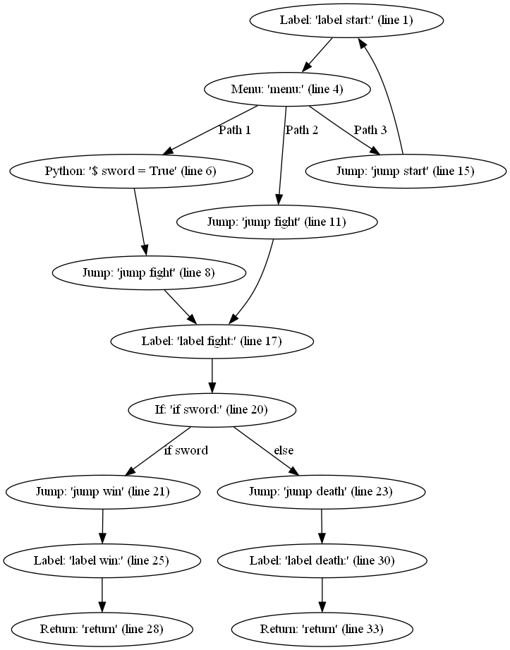

# End-of-Degree project report

- **Project name**: Renpath
- **Author**: Léo CHARTIER
- **School**: ALGOSUP
- **Degree**: Chef de projet en solutions logicielles pour l'internet des objets (IoT) - RNCP level 6 ([Website in French](https://www.francecompetences.fr/recherche/rncp/37046/))
- **Exam date**: September 11, 2024

## Abstract

The video game industry generates hundreds of billions of dollars anually, yet one of its genres remains a niche: Visual Novels. While many tools help the development of this type of game, no software exists to verify their quality, leading to mistakes making their way in published versions. Such a tool could help the existing developers and help beginners feel safer about trying to make their games. My project aims to fill this need and improve the Ren'Py community with the creation of an analytical software for their code. The first milestone is to find the best route that a player can take automatically. The tool uses pathfinding algorithms, logical analysis, and graph-pruning techniques tailored specifically for this task. Though community feedback has not been gathered yet, I hope that this project will encourage the developers to grow further and improve the content of their stories.

## Table of Contents

- [Abstract](#abstract)
- [Table of Contents](#table-of-contents)
- [Introduction](#introduction)
  - [Visual Novel definition](#visual-novel-definition)
  - [Context](#context)
  - [Scope and objectives](#scope-and-objectives)
- [Specifications](#specifications)
  - [Current requirements](#current-requirements)
  - [Future requirements](#future-requirements)
  - [Development guidelines](#development-guidelines)
  - [Success criteria](#success-criteria)
  - [Algorithms](#algorithms)
    - [Extraction/Conversion](#extractionconversion)
    - [Simplification](#simplification)
    - [Graph visualization](#graph-visualization)
    - [Analysis](#analysis)
- [Choices](#choices)
  - [Architectural choices](#architectural-choices)
  - [Algorithms](#algorithms-1)
    - [Generation - BFS](#generation---bfs)
    - [Simplification](#simplification-1)
    - [Analysis - Graph traversal](#analysis---graph-traversal)
- [Testing](#testing)
- [Management](#management)
- [Future work](#future-work)
- [Conclusion](#conclusion)
- [Glossary](#glossary)

## Introduction

As part of the ALGOSUP curriculum and its degree, the students must work on a personal software creation project. This official degree is split into two required levels: a level 6 and a level 7 (obtainable one year after the previous one).

Before going any further into the matter, I would like to state the following: \
This project is not my first. My previous end-of-degree project did not work out and I ended up rerouting myself on this second one. This document will only describe the new project.

### Visual Novel definition

First of all, I need to define a concept that is at the heart of this project: visual novels.

Visual novels (VN for short) are a type of video game that could be described as "books for computers." Most of the time, they are accompanied by images, music, and sounds, as well as videos and interactive buttons.

What differentiates them the most from our usual books is their interactivity. The player is provided with choices that change the story, offering a variety of scenarios.

### Context

The idea for this project came to me during my free time.

As I was playing a Visual Novel game, I was unexpectedly brought back to an earlier point in the game. I investigated the reason by looking at the code and found the issue. The developer used a `jump` (`goto` in some languages) instead of a `call`.

This kind of mistake can easily be made in this field of video games as creators of visual novels are more knowledgeable about arts than programming.

This led me to the idea for this project: Creating a tool that would assist developers and players by analyzing the different paths and more.

### Scope and objectives

The end product of this project is a tool targeting both creators and users of Visual Novel games.

For this first version, the tool is limited to reading the content of a game and creating a visual representation of all the choices that can be made and the paths that link them.

The only targeted engine is the most popular one in the field, [Ren'Py](https://www.renpy.org/). The name for the tool comes from it.

Some additional functionalities are already in place to prepare for the next step of this project, which could not have been finished in time for this first version. The original target for this version was to also have a basic analysis of the recovered data by finding the path to go to a specific point in the game.

## Specifications

### Current requirements

- The tool should be compatible with any version of Ren'Py.
  - *Many modern games still use old versions of the game engine.*
- The tool must hook itself to the game without modifying the original code.
- The tool must be easily removed from the game.
- The tool should start when the game is launched and to prevent it from starting normally.
- The tool must, for now, automatically create a file with a graph of the different paths.
- The graph file should be written using the DOT language and be placed at the root of the game.

Here is what a graph could look like:



### Future requirements

- The tool should allow the user to select a destination label from the game.
- The tool should be able to find the path and its requirements to reach this target.
- The tool should be able to write a file using the choices required to reach this target.
- The tool should allow the user to select a save file to change the starting point.

### Development guidelines

It is recommended to develop using Visual Studio Code along with the following extensions:
- [Python](https://marketplace.visualstudio.com/items?itemName=ms-python.python)
- [SonalLint](https://marketplace.visualstudio.com/items?itemName=SonarSource.sonarlint-vscode)
- [Ren'Py language](https://marketplace.visualstudio.com/items?itemName=renpy.language-renpy)

Having Python installed is NOT required.

### Success criteria

For the graph creation, the success criteria are:
- The graph must correctly show all the labels and choices available.
- All the labels and choices must correctly be linked with their respective names or requirements.

A graph is a complex structure that can be rearranged without changing meaning. This makes comparing two graphs in different formats quite tricky and creating one by hand will likely lead to mistakes. For this reason, no automated testing has been done for this step.

For the walkthrough creation, the success criteria are:
- The output file must contain one choice per line.
- After selecting those choices in the game, the player must end up at the selected location.
- After selecting those choices in the game, the variables must contain the same content as outputted by the tool.

Automated testing will be written for this step as the choices always have the same names and are in the same order.

A feature is considered complete once it fully works for the example test. See the [Testing](#testing) section for more information.

### Algorithms

#### Extraction/Conversion

Before being able to do anything, we must first extract the data from the game.

As mentioned earlier, I will leverage the power of the game engine for this task. Since it provides easy access to the game's content, doing so ensures the integrity of the data. This would not necessarily be true if I were to read the data manually from the files which would also take longer to code.

There are a few data types provided by the engine that will interest us in particular. Those data types represent nodes that make up the path that can be taken, one for each statement in the script.

Here is a list of those that are common with other languages and some of their attributes:
- `Label`: Represents a place in the script that allows it to be broken down for easier access.
  - `name`: A unique identifier that represents this label.
  - `block`: A list of nodes in the section of code referred to by the label.
- `Jump`: Moves the execution of the script somewhere else.
  - `target`: Name of the label to go to. 
- `Call`: Temporarily transfers the execution of the script elsewhere.
  - `label`: Name of the label to go to.
- `Return`: After a `Call`, makes the execution of the script go back where it came from.
- `If`: Selects one of multiple possibilities depending on some values.
  - `entries`: A list of pairs of conditions and blocks.
    - The block is a list of nodes from the statements to be run.
    - The condition defines whether this block should be run or not.

Some others are specific to the Ren'Py scripting language:
- `Menu`: Gives the player a choice to make and diverts the execution of the script accordingly.
- `Python`: Executes some arbitrary code in the Python language.
  - `code`: The code to be executed.
- `UserStatement`: Among other things, specify when to show or hide a screen. See the screen section for more details. <!-- TODO -->
  - `get_name()`: A function that returns "show screen", "hide screen" or "call screen".

One of those nodes also has a `next` attribute which is itself a node. It represents the statement following the current one and is used to progress the story.

A `Node` wrapper will be created to hold more data, including:
- `origin`: The underlying Ren'Py node.
- `parents` and `children`: Two lists of `Edges` that connect to this node.
- `screens`: A list of screens visible when the game processes this statement.
- `callers`: A list of previous `Call`s to know where to return to later on.

The main reason for the wrapper's existence is that the Ren'Py nodes do not provide a direct way to their predecessors which will be important as described further in this document.

A `Graph` and `Edge` classes will also be written for completeness and to make things easier to use.

The conversion of the data into the wrappers will take place using a Breadth First Search (BFS) algorithm. The start of the graph is always the label named "start". The search stops when all the nodes have an empty `next` value or when there is a `Return` with an empty call stack.

#### Simplification

The second step is to remove all the data we obtained from the game that is unnecessary or redundant. This will simplify the work of the following steps and make them faster.

There should be three possible levels of simplification:
- Keep everything
- Standard
- Minimalist

The "Keep everything" level will affect the conversion process, where it will also include the types of statements that were not discussed previously. It will also skip the simplification phase. This mode can be useful for debugging for example but is not recommended at all since the sheer amount of nodes will clutter and slow the rest of the process.

The "Standard" mode will only keep the nodes mentioned in the previous section, without modification.

For the "Minimalist" level, nodes will be removed following some rules over an iterative process until no more modifications can be done.

The first part of removing nodes goes as follows:
1. By default, only actuators and branches should be kept, i.e. `Menu`, `If`, and `Python` nodes.
2. The root of the graph must always be kept.
3. A `Python` node must be removed if the code is one of the following:
   - `volume(...)`
   - `renpy.music`
   - `renpy.pause(x)`
   - `renpy.end_replay()`
   - `set_mode_adv()`
   - `set_mode_nvl()`
4. A node with no parents and no children should be deleted.
   - This happens often as the nodes required by the framework are indistinguishable from the ones generated by the game.

Once this is done, conditional statements and, if the user desires so, menus, should be removed as well.
For this to work without affecting the flow of the graph, their parents and children will have to be merged like so:
1. Merge the children's edges that point to the same node. If there are conditions, they must be combined with an `or` operator.
2. If the product of the number of parent and child edges is less than 25, you may remove the node. Otherwise, leave it as it would make further algorithms too slow for what it's worth.

Removing a node is not straightforward as there could be some data loss.
1. Unregister the node from the graph along with its parent and children edges. Keep a copy of the old edges.
2. If it is a `Return` node, remove any duplicate children edges (this minimizes the possibilities of call stacks).
3. For each pair of parent and child edges, create a new edge with the same parent and child node. The conditions will be combined with an `and` operator.
   - If one of the two conditions is `True` or `False`, simplify the resulting condition.

#### Graph visualization

Graph visualization is probably the simplest requirement here.

As the actual display of the graph is very complex and out of scope, we will use a third-party program.
The selected one is [Graphviz](https://graphviz.org/) for its simplicity. Due to some performance issues with more complex graphs rising from the improvements on Renpath, other tools such as [Mermaid](https://mermaid.js.org/), [NetworkX](https://networkx.org/) or [Gephi](https://gephi.org/) could be viable as replacements.

While a Python library exists for Graphviz, importing external assets in Ren'Py is extremely difficult and has been rejected. Instead, a raw text file will be created in the DOT format and it will be up to the user to run the software on that file.

Here is what the file for the earlier graph should look like:
```grapviz
digraph path {
	0 [label="Label: 'label start:' (line 1)"]
	1 [label="Menu: 'menu:' (line 4)"]
	2 [label="Python: '$ sword = True' (line 6)"]
	3 [label="Jump: 'jump fight' (line 11)"]
	4 [label="Jump: 'jump start' (line 15)"]
	5 [label="Jump: 'jump fight' (line 8)"]
	6 [label="Label: 'label fight:' (line 17)"]
	7 [label="If: 'if sword:' (line 20)"]
	8 [label="Jump: 'jump win' (line 21)"]
	9 [label="Jump: 'jump death' (line 23)"]
	10 [label="Label: 'label win:' (line 25)"]
	11 [label="Label: 'label death:' (line 30)"]
	12 [label="Return: 'return' (line 28)"]
	13 [label="Return: 'return' (line 33)"]

	0 -> 1
	1 -> 2 [label="Path 1"]
	1 -> 3 [label="Path 2"]
	1 -> 4 [label="Path 3"]
	2 -> 5
	3 -> 6
	4 -> 0
	5 -> 6
	6 -> 7
	7 -> 8 [label="if sword"]
	7 -> 9 [label="else"]
	8 -> 10
	9 -> 11
	10 -> 12
	11 -> 13
}
```

The first half corresponds to the nodes and the second to the edges connecting them.

Since an id is necessary, the nodes are represented by their index in the list of nodes.

For the edges, the label corresponds to the name of the choice or the requirement to take that path. If both are present, separate the two with a line feed (`\n`).

The label for the nodes is as follows:\
`NodeType: 'code that generated this node' (relative/path/to/file, line number)`

#### Analysis

Once the graph is extracted and preferably simplified, finding the desired path can begin.

The analysis of a path will be done with two types of "heads" traversing the graph using Breadth First Seach once again. One will go backward (also called upward) from the end node and the second from the starting node forward (also called downward).

Both types of heads will traverse the graph, updating their variables until they reach their target. When a node reaches a fork in the road, it will duplicate itself. When it encounters a condition, it will add a restriction on its variables respectively. If the condition is impossible, that path cannot be taken and the head is deleted. The same goes if the head is in a dead end that is not their target.

When a head is on a node that has already been visited by another head, delete the latter one. Use the old state of the deleted head to update the restrictions and variables of the current head.

> [!NOTE]
> If both heads are the same, we are running in a loop. The actions to take in such a case have yet to be defined.

The first head to traverse the graph will be the backward one. Once the traversal is done, all the nodes that were not visited will be pruned (deleted). Then the forward one will go, also with pruning. The process will repeat until no more pruning happens from either head.

At this point, the graph can be in one of two states:
- The graph is linear. We are done and can continue onwards.
- The graph is not linear and there are still multiple paths.

In the second case, all the remaining choices lead to the same conclusion. We use a Wave Function Collapse-like algorithm where we "observe" by removing one of the choices available to the player and "collapse" by repeating the sequence with both heads.

Finally, the final path is walked along while extracting the choices that must be made. These choices are then written in a `path.txt` file at the root of the game. Each entry should be on a separate line.

## Choices

### Architectural choices

For this tool, the two main languages will be Python and the Ren'Py scripting language.

Two reasons justify this choice:

Firstly, we must access the game's content in one way or another. This is done by parsing the script files. Thankfully, the game engine already does it to run the game. For this reason, utilizing the game engine will save us time and ensure no mistake exists in that process.

Secondly, this choice focuses the tool on a single game engine. This choice alone reduces the scope of the project greatly. The main reason this is important is that games created with generic game engines such as Unity or Godot do not have a specific format. It is up to the developer to create their own tools. It would be impossible for me to create something that matches each without requiring the developer to do additional work.

While those two languages work fine, both being interpreted languages makes them quite slow. This can be an issue when running heavy algorithms such as this tool with long and winding games. Once the tool is fully written, another more powerful programming language could be used to improve performance.

Adding a new programming language would require making an external program. An interface would then be necessary between the extraction step done on the game engine and the more demanding algorithms in the new language. For debugging purposes, a serializer has already been implemented for the `Graph` class and could be used in this process.

### Algorithms

#### Generation - BFS

The first algorithm used is BFS for the generation. This algorithm is used over Depth First Search (DFS) because of call stacks.

When a `Call` statement is found, the game has to keep track of this location for when a `Return` is encountered. This location is saved on the call stack. Because a node can be part of multiple paths, it can also be part of several call stacks. When a connection to an existing node is made, the new call stacks are merged with the existing ones and propagated to the rest of the graph.

With DFS, the propagation would last until the very last node of the graph. This operation is very time-consuming. By using BFS, path merging is more likely to take place early with very little propagation.

#### Simplification

Despite its `O(n²)` time complexity, this step is necessary for the other algorithms to work properly.

While it increased on average by **20.26%** the time taken for the generation, the size of the graph reduced by **83.78%**.

The actual impact on the later features has not been measured as they have not been implemented yet. I believe it is safe to say this improvement was more than necessary, especially if the game is lengthy and convoluted.

#### Analysis - Graph traversal

The analysis takes from two domains: pathfinding and the satisfiability problem.

The satisfiability problem must often be solved by using brute force. This is a lengthy procedure and is not fit for the complex expressions possibly encountered.

As mentioned earlier, this issue is tackled by pruning the graph of the nodes and edges that cannot be part of the path. In other words, if a condition has no possible solution, we know that the descending nodes are unattainable and can remove them. We traverse the graph to know which nodes must not be removed.

This is repeated multiple times in both directions to ensure the effects from removing a node are properly propagated.

We also use the Breadth First Search algorithm here for the same reasons as the generation step. When two heads collide, we want it to happen early to avoid needless propagation.

## Testing

To ensure the coverage of most of the existing games, this tool has been regularly tested on multiple ones. Many are freely available on [itch.io](https://itch.io/games/free/tag-renpy).

Since each game is different, no specific test environment has been set up. An example is provided [here](https://github.com/leo-chartier/renpath/tree/main/tests) for [Doki Doki Literature Club!](https://en.wikipedia.org/wiki/Doki_Doki_Literature_Club!). \
This game has been selected to serve as an example due to its popularity with two million downloads in its first four months of release, and the fact that anyone can get it for free.

This same game has also been selected as the "ultimate test". The game makes use of very powerful tools, some of which are not meant for direct use in a Visual Novel. This uniqueness proves that if the tool successfully handles it, it is also capable of working on any other game.

As far as development is concerned, the main testing game is [Everlasting Summer](https://store.steampowered.com/app/331470/Everlasting_Summer/). It contains a lot of possible paths to challenge the tool. It also turned out quite useful when working on `Screen`s thanks to its movement mechanic that uses a custom map.

## Management

From my attempt at my previous end-of-degree project, I learned that working on this project while at school was not an easy task.

With all the classes, homework, and projects that must be continued at home, and keeping some time for myself, finding a good time slot was almost impossible. Every time I tried to make a schedule and plan, there always was something more important coming up or I would not muster the required motivation.

Planning not being my forte, I took the opportunity to test a less systematical approach. I decided to go at my own pace and work when I could with no predefined schedule. The only metrics I used were my targeted goal and my progress. This progress was tracked using a TODO list in a local file on my computer.

I decided not to start by writing documents either. I have seen in my scholarship the benefits and downsides of making specifications. I wanted to challenge myself and see how well I would perform without those. Now that the first version is complete, I will be able to make those specifications and compare them with my current status.

In the end, due to a lack of time, I had to lower the scope of the first version. I only had enough time to start working on the analysis step.

## Future work

As mentioned above, the first step is to write the specifications from the beginning. The functional specifications are already complete and I have started working on the technical specifications.

The reason I opted to work on those documents right now is that the current state of the code left for desire. Constructing a more stable structure will allow me to rewrite the code in a better way. This refactoring step will be important for later as it will be easier to improve upon and maintain the code.

While reworking the code, I will also collect feedback. I am aware I have an indirect competitor. Gathering insights into what users think of my product at this stage is crucial for future features.

Finally, once all this is done, I can continue working on implementing the analysis system.

Potential changes for later versions could include:
- Switch to a more performant programming language
- Improvement of the algorithms' performance
- Ability to use a save file as a starting point
- In-depth code analysis

## Conclusion

This project has been both stimulating and instructive, and I plan on developing it as far as I can.

I learned valuable insights from it. It not only allowed me to try out a new form of management but also taught me how to handle unexpected issues rising on a familiar topic. I also found the process of coming up with such complex algorithms very satisfying, especially when they did not work as I had planned.

Overall, I am optimistic that this tool will help the Ren'Py community improve their projects by simplifying the verification process. I hope it will also attract new people to join this underrated sector of such a dynamic industry.

## Glossary

**Breadth First Search (BFS)**:
A search algorithm for graphs that explores paths simultaneously, taking one step at a time for each one. The priority is finding the best solution.

**Call stack**:
A data structure that records the different function calls made in a program. It allows the program to later return to the previous location and continue from there.

**Depth First Search (DFS)**:
A search algorithm for graphs that explores paths one at a time. Once it reaches the end of a branch, it goes back and tries the next one available. The priority is finding a solution quickly.

**DOT language**:
A syntax used by the Graphviz program. It describes the structure and content of a graph.

**Graph / Node / Edge**:
Three related data types. A graph contains nodes (a.k.a. vertices) linked by edges. In our case, the graph is directed. It means each edge has a given direction, dictating the flow of the graph.

**Head**:
Friendly name given to the tracking structure in the algorithm. It refers to the Git software that keeps track of the current position with the `HEAD` variable.

**Interpreter**:
A program that reads instructions from a file and executes them. Contrary to how most programs work, these instructions do not require to be compiled (translated for the computer) beforehand. This leads to a slower execution of those instructions.

**Jump / Call / Return**:
Three types of branching instructions. Instructions are usually in order but sometimes require to move around elsewhere in the program. The `jump` instruction moves the location where the code is executed directly. `call`s do the same but keep track of where they were. The operation is reversed with `return` statements which move back to the location of the `call`.

**Label**:
Specific instruction which identifies a block of code with a name. This name can be used with branching instructions for easy reference.

**Pathfinding**:
The process of determining the shortest or most efficient route between two positions.

**Pruning**:
A technique that removes portions of a graph to reduce its size and thus its complexity.

**Ren'Py**:
Name of a software game engine that allows the easy creation of visual novels. It was developed in the Python programming language.

**Satisfiability problem (SAT)**:
The Boolean satisfiability problem is the problem of determining whether a solution exists to a specific equation. It is NP-complete, meaning the solutions cannot be found easily.

**Serialization**:
Process of saving data stored in the program's memory in a file. Loading the data back is called "deserialization". A file format often used is the JavaScript Object Notation (JSON).

**Visual Novel (VN)**:
A software providing users with some fiction as digital content. They consist of texts, (animated) images, and user interactivity. The interactive part leads to multiple routes, each with its ending.

**Walkthrough**:
A guide containing hints for video game players to improve themselves and advance through the game. For visual novels, they list the choices necessary to reach the intended ending.

**Wave Function Collapse (WFC)**:
A constraint-solving algorithm generally used in procedural generation (automatic data creation). The term is coined on the quantum mechanic concept that shares similarities with how the algorithm works.